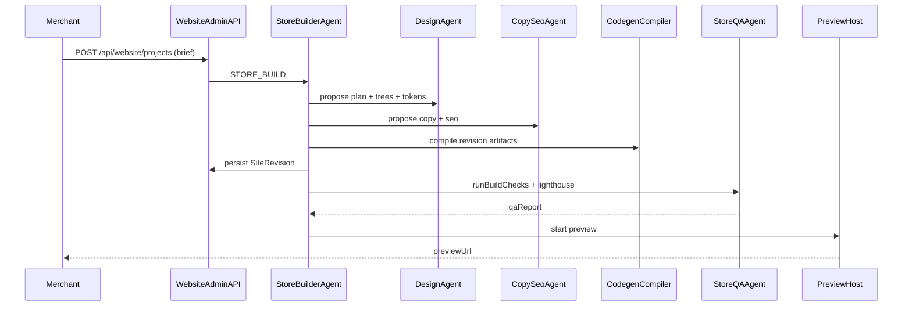
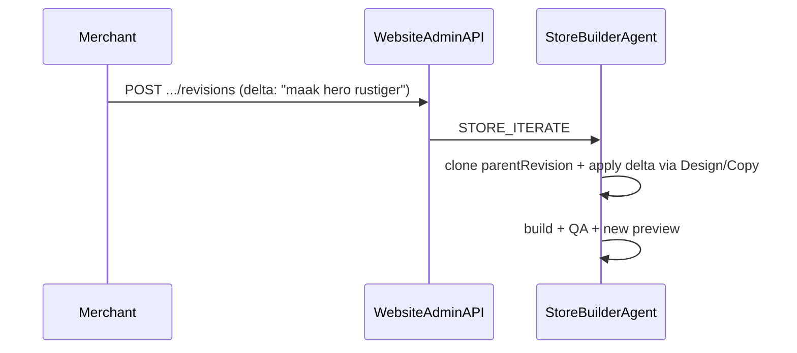
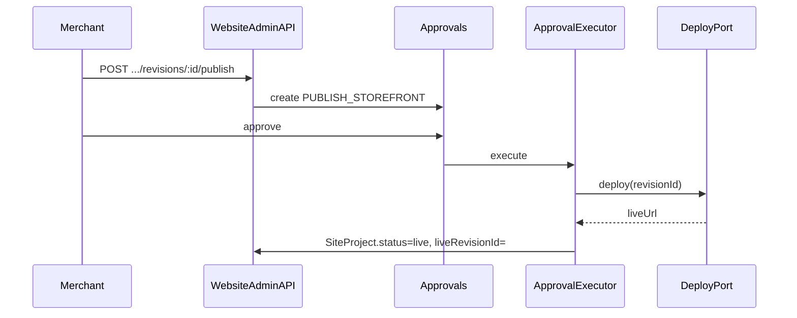

# Storefront Architecture

**Status:** Planned (design)  
**Charter:** [`runtime-charter.md`](./runtime-charter.md)  
**Department DNA:** [`../../project-dna/Aether/storefront-builder.md`](../../project-dna/Aether/storefront-builder.md)  
**API contracts:** [`storefront-api-contracts.md`](./storefront-api-contracts.md)

---

## 1. Goals

- Generate tenant storefronts as **versioned artifacts**, not one-off hand edits.
- Host all customer UI in a **fixed Next.js runtime** that mounts allowlisted blocks.
- Keep commerce truth in existing AETHER Core modules (catalog, orders, payments).
- Preview in sandbox; go live only via Approvals + `DeployPort`.

---

## 2. Packages and modules

| Path | Responsibility |
|------|----------------|
| `backend/src/modules/storefront-builder/` | Domain use cases: projects, revisions, builds, publish proposals |
| `backend/src/ai/intelligence/multi-agent/agents/StoreBuilderAgent.ts` | Orchestration specialist |
| `.../DesignAgent.ts` | Layout / tokens / page trees |
| `.../CopySeoAgent.ts` | Copy + SEO |
| `.../StoreQAAgent.ts` | QA reports |
| `storefront-runtime/` | Next.js App Router host, block registry, SDK to Core Storefront API |
| `frontend/src/pages/website/*` | Merchant admin Website surfaces |

**Not used:** MedusaJS storefront plugins, freeform repo-write outside artifact store.

---

## 3. Domain model

### 3.1 Entities

```
SiteProject
  id, tenantId, slug, primaryDomain?, status (draft|preview|live|archived)
  liveRevisionId?, createdAt, updatedAt

SiteRevision
  id, projectId, version (int), briefJson, planJson
  artifactsPath | artifactsBlob ref
  qaReportJson?, createdByAgent, parentRevisionId?
  createdAt

SitePage
  id, revisionId, path, title, seoJson, treeJson
  sortOrder

SiteAsset
  id, projectId, key, mimeType, url, metaJson

BuildJob
  id, revisionId, status (queued|running|succeeded|failed)
  logs?, previewUrl?, startedAt?, finishedAt?

DeployTarget
  id, projectId, provider (cloudflare|vercel|local)
  liveUrl?, configJson, lastDeployedRevisionId?
```

### 3.2 Relations to Core commerce

- Products/variants remain `Product` / `ProductVariant`.
- Storefront reads via public Storefront API (tenant slug), never by guessing admin keys.
- Future: `Cart` / `CartItem`, `Shipment`, `Refund`, `Promotion`, `Category`, product SEO/media fields — see dashboard IA data gaps.

### 3.3 Artifact layout (per revision)

```
revisions/{revisionId}/
  plan.json
  tokens.json
  tokens.css
  pages/
    index.tree.json
    products.tree.json
    products.[slug].tree.json   # template marker
    about.tree.json
    ...
  copy/
    nl.json
    en.json?
  overrides/                    # optional, AST-gated — refused in v1 (P05)
    *.tsx
  qa-report.json
```

**SitePlan contract (agents / codegen):** [`storefront-site-plan-schema.md`](./storefront-site-plan-schema.md)  
Compiler: `AllowlistCodegenCompiler` — unknown blocks and non-empty `overrides` → `CODEGEN_REJECTED`.

---

## 4. Ports

| Port | Direction | Notes |
|------|-----------|-------|
| `SiteRepositoryPort` | out | Persist projects/revisions/pages |
| `ArtifactStorePort` | out | Blob/FS for revision trees |
| `CodegenCompilerPort` | out | Plan + trees → artifacts; enforces allowlist |
| `PreviewHostPort` | out | Spin ephemeral preview; returns signed URL |
| `DeployPort` | out | Promote revision to live edge |
| `StorefrontCatalogPort` | in/out | Read products for codegen context + public API |
| `LlmInferencePort` | out | Shared with Mail/Admin — Local AI First |
| `ApprovalPort` | out | `PUBLISH_STOREFRONT` action type |
| `PersonalBrainPort` | out | Store brief/brand memories |

---

## 5. Sequences

### 5.1 First build



### 5.2 Iterate



### 5.3 Publish



---

## 6. storefront-runtime

### 6.1 Role

Single Next.js App Router application that:

1. Resolves tenant from host / path slug.
2. Loads **live** (or preview-token) revision manifest.
3. Renders `PageTree` through the block registry.
4. Calls public Storefront APIs for catalog, cart (later), checkout (later).

### 6.2 Block registry

Each block: React component + Zod props schema + a11y contract. Unknown block types → fail build (codegen) or render safe fallback in preview with QA error.

### 6.3 Preview vs live

| Mode | Resolution | Auth |
|------|------------|------|
| Preview | `BuildJob.previewUrl` + signed token for revision | Token HMAC short TTL |
| Live | `DeployTarget.liveUrl` + `liveRevisionId` + artifact live pointer | Public |

**Preview URL contract (P08 → storefront-runtime P09):**

```
http://localhost:<STOREFRONT_PREVIEW_PORT>/preview/:revisionId?token=<hmac>
```

- Default port: `4177` (`STOREFRONT_PREVIEW_PORT`, Appendix G)
- Token: HMAC payload `{ revisionId, projectId, tenantId, exp }` signed with `STOREFRONT_PREVIEW_HMAC_SECRET` (TTL **15 minutes**, Appendix G)
- Runtime may also accept `Authorization: Preview <token>` on public Storefront API (P04)

**Local live pointer (under `STOREFRONT_ARTIFACTS_DIR`):**

```
live/{tenantId}/{projectId}/revision.json   # source of truth
live/{tenantId}/{projectId}/CURRENT         # revisionId only
live/{tenantId}/{projectId}/artifacts       # optional symlink/junction → revisions/{revisionId}
revisions/{revisionId}/...                  # compiled artifacts (servePath)
```

Env: `STOREFRONT_ARTIFACTS_DIR`, `STOREFRONT_PREVIEW_PORT`, `STOREFRONT_PREVIEW_HMAC_SECRET`, `STOREFRONT_DEPLOY_ENABLED`.

---

## 7. Security and tenancy

- All admin website routes: API key + tenant header match (existing merchant-auth).
- Public storefront routes: tenant slug only; never leak other tenants’ revisions.
- Artifact compiler rejects disallowed AST nodes.
- Publish action registered in `ApprovalExecutor` with audit log.
- Preview tokens are single-revision scoped and non-escalating.

---

## 8. Observability

- Business events: `website.revision.created`, `website.build.finished`, `website.publish.approved`, `website.deploy.succeeded|failed`
- Sentry: storefront-runtime + builder jobs
- Lighthouse budgets recorded on `BuildJob` / `qaReportJson` (align with weekly Lighthouse workflow when wired)

---

## 9. Feature flags

Suggested env / `TenantFeature` keys:

- `STOREFRONT_BUILDER_ENABLED` — admin APIs + agents
- `STOREFRONT_PUBLIC_API_ENABLED` — public catalog/pages
- `STOREFRONT_DEPLOY_ENABLED` — live deploy (default off until Gate-ready)

---

## 10. Implementation slices (build order)

1. Prisma models + repository adapters  
2. Admin project/revision CRUD (no agents)  
3. Public catalog + page read from a manually seeded revision  
4. Codegen compiler + allowlist tests  
5. Agents + Command intents  
6. Preview host  
7. Publish approval + DeployPort stub → real provider  
8. Cart/checkout module + CheckoutShell block wiring  

---

## 11. Out of scope for v1 architecture

- Merchant writing arbitrary Next.js apps outside the runtime  
- Multi-region active-active storefront DBs  
- Visual drag-drop editor (iterate via NL + page tree inspector first)  
- Auto-billing uplift attribution for “store built” events (outcomes remain separate)
