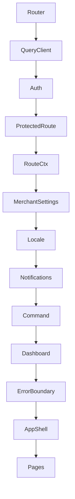
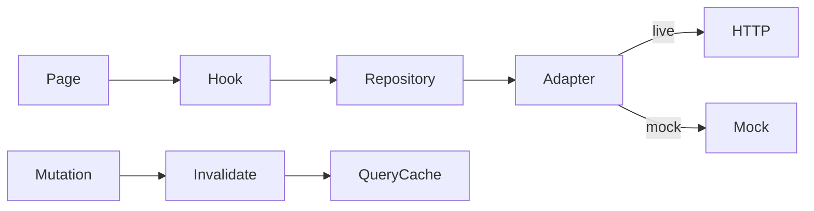
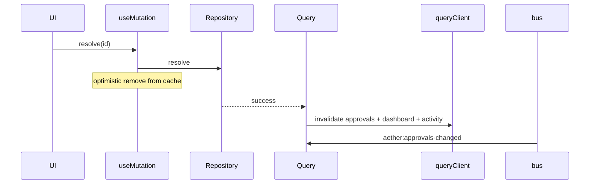

# AETHER Frontend Architecture

**Version:** 1.1 | **Stack:** Vite + React 18 + TypeScript + React Router v6

Production-grade foundation for the AETHER merchant operating system. Radical simplicity: one shell, one data layer, clear server/client state separation.

---

## Principles

- **Runtime truth:** [`../docs/runtime-charter.md`](../docs/runtime-charter.md)
- **Vision:** `project-dna/`
- **UI quality:** [`../docs/ui-definition-of-done.md`](../docs/ui-definition-of-done.md)

---

## Tech choices

| Concern | Choice | Why |
|---------|--------|-----|
| Routing | React Router v6 nested layouts (`<Outlet />`) | Idiomatic, zero migration cost vs Next.js |
| Server state | TanStack Query v5 | Cache, dedup, optimistic mutations, invalidation |
| Client state | Zustand (persist for UI prefs) | Lightweight, no provider boilerplate |
| API | `lib/api/` (`client.ts`, `routes.ts`, `errors.ts`) | Typed errors, retry, timeout, auth headers; mock/live via `DataAdapter` |
| Auth | `AuthProvider` + `AuthPort` stub + `ProtectedRoute` | Access token in sessionStorage; refresh in HttpOnly cookie; `/login` when unauthenticated |
| Toasts | Sonner + `showCalmToast` | Calm, debounced; load errors use `ErrorState` |

---

## Provider tree



---

## Auth & API headers

- **Adapter:** [`AuthPort`](src/lib/auth/AuthPort.ts) + [`createAuthAdapter`](src/lib/auth/createAuthAdapter.ts) — default `stub` ([`stubAuthAdapter`](src/lib/auth/adapters/stubAuthAdapter.ts)); set `VITE_AUTH_PROVIDER=jwt` for Argon2 login + HttpOnly refresh cookie ([`jwtAuthAdapter`](src/lib/auth/adapters/jwtAuthAdapter.ts)).
- **Session:** [`sessionStorage.ts`](src/lib/auth/sessionStorage.ts) persists access token to `sessionStorage` (`aether.session.v1`); refresh token stays in HttpOnly cookie. Optional dev auto-login: `VITE_AUTH_AUTO_LOGIN=true`.
- [`AuthProvider`](src/lib/auth/AuthProvider.tsx) restores session on mount, exposes `signIn` / `signOut`, syncs `setAuthToken` + `setAuthTenantId` on the API client.
- **Routes:** public [`/login`](src/pages/LoginPage.tsx) under `GuestOnlyRoute`; app shell under [`ProtectedRoute`](src/lib/auth/ProtectedRoute.tsx) (redirects to login when unauthenticated).
- **Permissions:** [`permissions.ts`](src/lib/auth/permissions.ts) + [`usePermission`](src/lib/auth/usePermission.ts) + [`RequirePermission`](src/lib/auth/RequirePermission.tsx) (e.g. settings = admin only).
- [`lib/api/client.ts`](src/lib/api/client.ts) reads tenant from `getAuthTenantId()` first, then `env.tenantId`. Sends `credentials: 'include'` for refresh cookies. On HTTP 401, attempts token refresh (JWT mode) before `setOnUnauthorized` → sign-out.
- Backend supports API-key + RBAC in parallel with optional merchant JWT — swap adapter via env, not page code.

---

## Route factory

Routes are declared once in [`lib/navigation/routes.ts`](src/lib/navigation/routes.ts) (`appRoutes` metadata). [`lib/navigation/appRoutes.tsx`](src/lib/navigation/appRoutes.tsx) maps each path to a lazy page component; [`App.tsx`](src/App.tsx) renders nested layout groups via `getRoutesByLayout()` and redirects from `getRedirectRoutes()`.

### Canonical URLs

| Path | Behavior |
|------|----------|
| `/command-center` | Home / Command Center (canonical) |
| `/`, `/home`, `/cockpit`, `/dashboard` | Redirect → `/command-center` |
| `/activity`, `/history` | Redirect → `/timeline` |
| `/approvals`, `/insights`, `/workstream`, `/suppliers`, `/settings`, … | Module pages |

Cross-module links: [`lib/navigation/moduleLinks.ts`](src/lib/navigation/moduleLinks.ts).

### Layout groups (under `AppShell`)

| Layout | Routes |
|--------|--------|
| `OverviewLayout` | command-center, workstream, approvals, insights, timeline |
| `DeepModuleLayout` | suppliers, products, orders, emails, autonomous, … (+ breadcrumb) |
| `SettingsLayout` | settings (+ breadcrumb, `?section=` URL sync) |

**To add a module:**

1. Add metadata to `appRoutes` in `routes.ts` (`path`, `module`, `layout`, `inNav?`, `skeleton?`)
2. Add lazy import in `lazyPageMap` in `appRoutes.tsx`
3. Create page under `pages/` (thin) and hooks under `features/<module>/hooks/`
4. Add query keys in `lib/query/keys.ts`
5. Optional: `minimalNavItems` entry if the module belongs in the sidebar

No manual per-route JSX blocks in `App.tsx`.

---

## Data flow

See [`docs/data-flow.md`](docs/data-flow.md) for the full strategy (repositories, mock swap, cross-screen invalidation).  
See [`docs/API_INTEGRATION.md`](docs/API_INTEGRATION.md) for mock/live env vars, API client, and backend onboarding.



### Approvals resolve (optimistic)



---

## Folder structure

```
src/
├── components/
│   ├── shell/              # AppShell, ModulePageLayout, AppTopBar, SyncIndicator
│   └── ui/                 # Design system (@/components/ui)
├── features/               # Domain modules (co-located hooks)
│   ├── approvals/hooks/
│   ├── suppliers/hooks/
│   ├── command-center/hooks/
│   └── settings/hooks/
├── lib/
│   ├── api/                # client.ts, routes.ts, errors.ts, index.ts
│   ├── data/               # adapters, repositories (DataAdapter pattern)
│   ├── auth/               # AuthProvider, ProtectedRoute
│   ├── config/             # env.ts (incl. VITE_DATA_SOURCE)
│   ├── navigation/         # routes.ts + appRoutes.tsx
│   ├── query/              # client, keys, hooks.ts, invalidation bridge
│   └── stores/             # uiStore + appShellStore (badges, shell signals)
├── types/                  # Domain entities (approval, activity, command, …)
├── pages/                  # Thin route entry points
└── hooks/                  # Re-exports + shared page hooks (migrating to features/)
```

**Rule:** Features import from `lib/*` and `components/ui|shell`. No cross-feature internal imports.

---

## State decision tree

| Data | Where |
|------|-------|
| API lists, details, metrics | TanStack Query via repositories (`useAetherQuery`) |
| Mutations (save, resolve, create) | `useMutation` / `useAetherMutation` + invalidate or optimistic |
| Dashboard SSE stream | `useDashboardStream` → `queryClient.setQueryData` |
| Sidebar collapse, palette open, notif panel | Zustand (`lib/stores/uiStore.ts`) |
| Pending approvals badge, last command time | Zustand (`lib/stores/appShellStore.ts`) |
| Command history, execute side effects | `CommandContext` |
| Notification list + push | `NotificationContext` |
| Merchant settings | Query cache + `MerchantSettingsContext` |
| Per-page filters, tabs, selection | Local `useState` (URL params later) |

---

## Module page layout

[`ModulePageLayout`](src/components/shell/ModulePageLayout.tsx) standardizes `PageHeader` (or custom `header`), `RouteContextStrip`, and `AsyncBoundary`. Use `wrapAsync={false}` when the page owns toolbars or nested boundaries (Approvals, Suppliers, Activity, Insights).

---

## Global patterns

### Error handling
See [`docs/error-handling.md`](docs/error-handling.md).
- **Load failures:** `AsyncBoundary` → `ErrorState` (no duplicate toast)
- **Mutations:** `useAetherMutation` + `showErrorToast` (typed `ApiError` / `NetworkError`)
- **Render throws:** `ErrorBoundary` (app + per-route) + `CriticalErrorDialog` at root
- **Logging:** `lib/observability/logger.ts` (`VITE_LOG_LEVEL`)

### Toast policy
See [`lib/toast.ts`](src/lib/toast.ts). Toasts = transient action feedback. Not for initial page load errors.

### Config
All env reads via [`lib/config/env.ts`](src/lib/config/env.ts). Never `import.meta.env` in feature code.

### Real-time
[`QueryInvalidationBridge`](src/lib/query/QueryInvalidationBridge.tsx) listens to live bus + approval events and invalidates relevant query keys.

### Background sync
[`SyncIndicator`](src/components/shell/SyncIndicator.tsx) in `AppTopBar` uses `useIsFetching()` for a subtle refetch dot.

---

## Migration status

| Surface | Status |
|---------|--------|
| Data layer | All nav modules via repositories; `VITE_DATA_SOURCE=mock` full offline |
| Approvals, Workstream | Query + optimistic resolve (`useAetherMutation`) |
| Suppliers | Query + monitor/create/patch mutations |
| Settings | Query + optimistic PUT; connected-services & operating-metrics |
| Command execute | `useAetherMutation` + invalidates + side effects |
| Dashboard | SSE (live) / poll (mock) → Query cache |
| Emails, Activity, Insights, Products, Orders, Autonomous, Negotiations, Outcomes | Query via repositories |
| Telemetry | `adminRepository.trackUiEvent` (mock no-op) |

**Status: complete** (incremental URL-state and real JWT auth remain future work).

---

## Dev tools

- **TanStack Query Devtools:** bottom-left in dev (`env.isDev`)
- **Testing:** [`docs/testing.md`](docs/testing.md)
- **Verify:** `npm run verify:ui`, `npm test`, `npm run test:flows`, `npm run test:visual`, `npm run test:a11y`

---

## Future (12–18 months)

- JWT adapter implementing `AuthPort` + `setOnUnauthorized` + backend Bearer middleware
- URL-driven filters (`/suppliers?tab=active`)
- `createBrowserRouter` loaders for route-level prefetch
- Multi-tenant switcher in `UserMenu`
